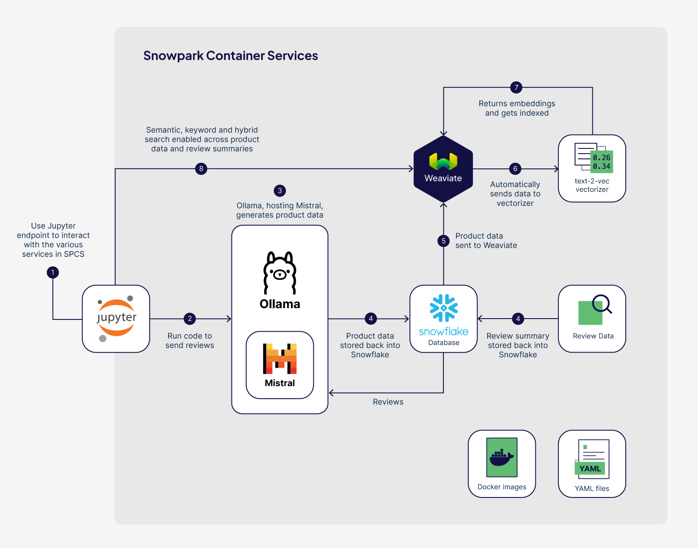
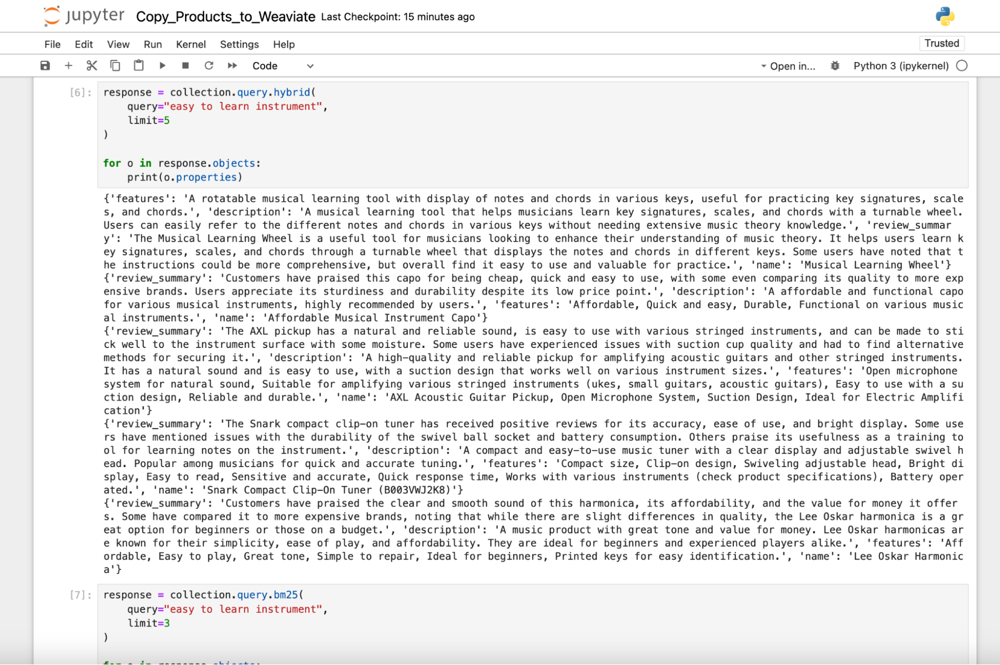

author: Jon Tuite
id: weaviate-generative-feedback-loop
summary: Create an end-to-end generative feedback loop by using an LLM to turn product review data into a searchable products collection in Weaviate.
categories: Getting-Started
environments: web
status: Published 
feedback link: https://github.com/Snowflake-Labs/sfguide-getting-started-weaviate-on-spcs/issues
tags: Weaviate, Containers, Ollama, Mistral, LLM, vectors, vectorizer, embeddings, semantic search, hybrid search 

# Weaviate Generative Feedback Loop

## Overview 
Duration: 2-3 hours

[Weaviate](https://weaviate.io/) is an open source, AI-native vector database that helps developers create intuitive and reliable AI-powered applications. In this guide, we will deploy Weaviate, a Text2Vec vectorizer, the Mistral LLM served by Ollama, and a Jupyter Notebook server all within Snowpark Container Services (SPCS). Using these services, we will summarize product reviews with an LLM, then use these product summaries to create a unique search experience that allows users to search by more than just keywords, but instead by how it feels to interact with certain products.

### What You Will Learn 

- How to build and deploy Weaviate, Ollama, a Text2Vec vectorizer module and Jupyter in Snowpark Container Services
- How to create a generative feedback loop with an LLM and a vector database
- How to automatically create embeddings (vectors) for your searchable data
- How to use volume mounts to persist changes in the file system
- How to load data from Snowflake into a Weaviate vector database
- How to run Keyword, Semantic, and Hybrid searches on your data in Weaviate

### What You Will Need

- [Docker Desktop](https://www.docker.com/products/docker-desktop/) installed
- [Python 3.10](https://www.python.org/downloads/) installed
    - Note that you will be creating a Python environment with 3.10 in the **Setup the Local Environment** step
- (Optional) [Git](https://git-scm.com/book/en/v2/Getting-Started-Installing-Git) installed
    - **Download the git repo [here](https://github.com/Snowflake-Labs/sfguide-getting-started-weaviate-on-spcs.git)**. You can simply download the repo as a .zip if you don't have Git installed locally.
- (Optional) [VSCode](https://code.visualstudio.com/) (recommended) with the [Docker](https://marketplace.visualstudio.com/items?itemName=ms-azuretools.vscode-docker), [Python](https://marketplace.visualstudio.com/items?itemName=ms-python.python), and [Snowflake](https://marketplace.visualstudio.com/items?itemName=snowflake.snowflake-vsc) extensions installed.
- A non-trial Snowflake account in a supported [AWS region](https://docs.snowflake.com/en/developer-guide/snowpark-container-services/overview#available-regions).
- Snowpark Container Services (SPCS) enabled on your account

### What You Will Build 

- A complete end-to-end solution from loading data, generating new data with an LLM, and searching using Weaviate
- A hosted Weaviate service running inside of Snowpark Container Services
- A hosted LLM (Mistral 0.2), using Ollama
- A hosted Jupyter Notebook service running inside of Snowpark Container Services
- A Jupyter Notebook to load review data into Snowflake then generate new product data using an LLM
- A Jupyter Notebook to load and query/search a collection of products

## Prerequisites

- (optional) The [weaviate-on-spcs](weaviate-on-spcs.md) guide

- [Product review dataset](https://www.kaggle.com/datasets/eswarchandt/amazon-music-reviews) from Kaggle

These steps are only shown as an example, and following along with the example may require additional rights to third-party data, products, or services that are not owned or provided by Snowflake. Please ensure that you have the appropriate rights in third-party data, products, or services before continuing.


## Log into Snowflake

Download the [SnowSQL](https://docs.snowflake.com/en/user-guide/snowsql) client. Use the SnowSQL client to connect to Snowflake.

```bash  
snowsql -a "YOURINSTANCE" -u "YOURUSER"
```

It is recommended that you use SnowSQL because you will be uploading files from your local machine to your Snowflake account, but you can also [upload files to stages directly from Snowsight, if you prefer](https://docs.snowflake.com/en/user-guide/data-load-local-file-system-stage-ui#upload-files-onto-a-named-internal-stage).

## Set up environment

Set up OAUTH integration. This will allow Snowflake to authenticate users of your service.

```sql
-- OAuth Integration --
USE ROLE ACCOUNTADMIN;
CREATE SECURITY INTEGRATION SNOWSERVICES_INGRESS_OAUTH
  TYPE=oauth
  OAUTH_CLIENT=snowservices_ingress
  ENABLED=true;
```

Give the SYSADMIN the ability to bind service endpoints. This will allow the SYSADMIN to create services.

```sql
-- Bind Service Grant
USE ROLE ACCOUNTADMIN;
GRANT BIND SERVICE ENDPOINT ON ACCOUNT TO ROLE SYSADMIN;
```

Create a role, and a user, for the Weaviate instance. We will use this user to log into our Jupyter service later.

```sql
-- Weaviate Role --
USE ROLE SECURITYADMIN;
CREATE ROLE WEAVIATE_ROLE;

-- Weaviate User --
USE ROLE USERADMIN;
CREATE USER weaviate_user
  PASSWORD='weaviate123'
  DEFAULT_ROLE = WEAVIATE_ROLE
  DEFAULT_SECONDARY_ROLES = ('ALL')
  MUST_CHANGE_PASSWORD = FALSE;

-- Grant Role to User --
USE ROLE SECURITYADMIN;
GRANT ROLE WEAVIATE_ROLE TO USER weaviate_user;
```

Create a warehouse for processing data in Snowflake.

```sql
-- Weaviate Warehouse --
USE ROLE SYSADMIN;
CREATE OR REPLACE WAREHOUSE WEAVIATE_WAREHOUSE WITH
  WAREHOUSE_SIZE='X-SMALL'
  AUTO_SUSPEND = 180
  AUTO_RESUME = true
  INITIALLY_SUSPENDED=true;
```

Create a database, image repository and stages. The image repository will house our container images, and stages will serve as a home for our service specification files, as well as files created and saved on the service. We will also create our stage for the product review data here.

```sql
-- Weaviate Database --
-- + image repo --
-- + stages --
USE ROLE SYSADMIN;
CREATE DATABASE IF NOT EXISTS WEAVIATE_DEMO;
USE DATABASE WEAVIATE_DEMO;
CREATE IMAGE REPOSITORY WEAVIATE_DEMO.PUBLIC.WEAVIATE_REPO;
CREATE OR REPLACE STAGE YAML_STAGE;
CREATE OR REPLACE STAGE DATA ENCRYPTION = (TYPE = 'SNOWFLAKE_SSE');
CREATE OR REPLACE STAGE FILES ENCRYPTION = (TYPE = 'SNOWFLAKE_SSE');
CREATE OR REPLACE STAGE REVIEW_DATA ENCRYPTION = (TYPE = 'SNOWFLAKE_SSE');
```

Grant privileges on the databases to the WEAVIATE_ROLE:

```sql
-- Grants for Weaviate Role --
USE ROLE SECURITYADMIN;
GRANT ALL PRIVILEGES ON DATABASE WEAVIATE_DEMO TO WEAVIATE_ROLE;
GRANT ALL PRIVILEGES ON SCHEMA WEAVIATE_DEMO.PUBLIC TO WEAVIATE_ROLE;
GRANT ALL PRIVILEGES ON WAREHOUSE WEAVIATE_WAREHOUSE TO WEAVIATE_ROLE;
GRANT ALL PRIVILEGES ON STAGE WEAVIATE_DEMO.PUBLIC.FILES TO WEAVIATE_ROLE;
GRANT ALL PRIVILEGES ON STAGE WEAVIATE_DEMO.PUBLIC.REVIEW_DATA TO WEAVIATE_ROLE;
```

## Loading Data

Start by loading data into Snowflake.  Skip this step if your data is already there.

Dataset:
[https://www.kaggle.com/datasets/eswarchandt/amazon-music-reviews](https://www.kaggle.com/datasets/eswarchandt/amazon-music-reviews)

These steps are only shown as an example, and following along with the example may require additional rights to third-party data, products, or services that are not owned or provided by Snowflake.  Please ensure that you have the appropriate rights in third-party data, products, or services before continuing.

We'll create a CSV file format that reflects our dataset.

```sql
-- File format --
USE ROLE SYSADMIN;
USE DATABASE WEAVIATE_DEMO;
create or replace file format my_csv_format 
  type = csv 
  field_delimiter = ',' 
  skip_header = 1 
  null_if = ('NULL', 'null') 
  FIELD_OPTIONALLY_ENCLOSED_BY='"'
  empty_field_as_null = true;
```

Then we will upload our data to the `PRODUCT_REVIEWS` stage:

```sql
-- Put file into stage --
USE ROLE SYSADMIN;
USE DATABASE WEAVIATE_DEMO;
USE SCHEMA PUBLIC;
PUT file:///path/to/Musical_instruments_reviews.csv @REVIEW_DATA overwrite=true;
```

Then we will create the table to which we load the product review data.

```sql
-- Tables --
USE ROLE SYSADMIN;
USE DATABASE WEAVIATE_DEMO;
USE SCHEMA PUBLIC;

CREATE OR REPLACE TABLE 
    PRODUCT_REVIEWS (REVIEWERID varchar, ASIN varchar, 
    REVIEWERNAME varchar, HELPFUL varchar, 
    REVIEWTEXT varchar, OVERALL varchar, 
    SUMMARY varchar, UNIXREVIEWTIME varchar, REVIEWTIME varchar);
```

Next, we will load our stage data into the table.

```sql
USE ROLE SYSADMIN;
USE DATABASE WEAVIATE_DEMO;
USE SCHEMA PUBLIC;
COPY INTO PRODUCT_REVIEWS FROM @REVIEW_DATA FILE_FORMAT = (format_name = 'my_csv_format' , error_on_column_count_mismatch=false);
```

Let's quickly confirm our data is in the table.

```sql
-- Confirm data --
USE ROLE SYSADMIN;
USE WAREHOUSE WEAVIATE_WAREHOUSE;
SELECT * FROM WEAVIATE_DEMO.PUBLIC.PRODUCT_REVIEWS; 
```

Finally, we will ensure our `WEAVIATE_ROLE` has necessary permissions to work with this table.

```sql
-- Grants for Weaviate Role --
USE ROLE SECURITYADMIN;
GRANT SELECT ON TABLE WEAVIATE_DEMO.PUBLIC.PRODUCT_REVIEWS TO ROLE WEAVIATE_ROLE;
```

## Deploying Jupyter

The first service we will deploy is Jupyter.

### Build and push the image

First, we build the image.

```sh
docker build --rm --platform linux/amd64 -t jupyter ./images/jupyter
```

Next we will retrieve our repository URL by issuing the following command in our Snowflake client.

```sql
USE ROLE SYSADMIN;
USE DATABASE WEAVIATE_DEMO;
USE SCHEMA PUBLIC;
SHOW IMAGE REPOSITORIES;
```

The result will include a `repository_url`, which will look something like `<SNOWFLAKE_ACCOUNT>-<SNOWFLAKE_ORG>.registry.snowflakecomputing.comregistry.snowflakecomputing.com/weaviate_demo/public/weaviate_repo`.

Next, we'll tag the image using this repository URL.

```sh
docker tag jupyter <SNOWFLAKE_ACCOUNT>-<SNOWFLAKE_ORG>.registry.snowflakecomputing.comregistry.snowflakecomputing.com/weaviate_demo/public/weaviate_repo/jupyter
```

To push to our registry, we will first need to log in.

```sh
docker login <SNOWFLAKE_ACCOUNT>-<SNOWFLAKE_ORG>.registry.snowflakecomputing.com  -u YOUR_SNOWFLAKE_USERNAME
```

Finally, we push the image.

```sh
docker push <SNOWFLAKE_ACCOUNT>-<SNOWFLAKE_ORG>.registry.snowflakecomputing.comregistry.snowflakecomputing.com/weaviate_demo/public/weaviate_repo/jupyter
```

### Update and push the spec

With our image in our repository, we will next have to update the [Jupyter spec file](../specs/jupyter.yaml), which is the specificiation that SPCS will use to create our Jupyter service. Within that spec, is an entry for `image`, which looks like this:

```yaml
image: "<SNOWFLAKE_ACCOUNT>-<SNOWFLAKE_ORG>.registry.snowflakecomputing.com/weaviate_demo/public/weaviate_repo/jupyter"
```

Update the `image` entry and replace `<SNOWFLAKE_ACCOUNT>-<SNOWFLAKE_ORG>` with your Snowflake acccount and Snowflake org, which you retrieved earlier with `SHOW IMAGE REPOSITORIES`.

Once you have updated and saved the Jupyter spec file, you can upload it to your existing `YAML_STAGE`.

```sh
USE ROLE SYSADMIN;
USE DATABASE WEAVIATE_DEMO;
USE SCHEMA PUBLIC;
PUT file:///path/to/jupyter.yaml @yaml_stage overwrite=true auto_compress=false;
```

### Provision the compute pool

Our service will need to run on a compute pool. We will create a dedicated compute pool for the Jupyter service:

```sql
-- Compute Pool --
USE ROLE SYSADMIN;
CREATE COMPUTE POOL IF NOT EXISTS JUPYTER_COMPUTE_POOL
  MIN_NODES = 1
  MAX_NODES = 1
  INSTANCE_FAMILY = CPU_X64_S
  AUTO_RESUME = true;

DESCRIBE COMPUTE POOL JUPYTER_COMPUTE_POOL;
```

Before moving to onto the next step, ensure that the `state` shown in the output of `DESCRIBE COMPUTE POOL JUPYTER_COMPUTE_POOL` shows `IDLE` or `RUNNING`.

### Deploy the service

Next, we will deploy our service to our compute pool, using the Jupyter spec we uploaded to the `YAML_STAGE`.

```sql
-- Service --
USE ROLE SYSADMIN;
USE DATABASE WEAVIATE_DEMO;
USE SCHEMA PUBLIC;
CREATE SERVICE JUPYTER
  IN COMPUTE POOL JUPYTER_COMPUTE_POOL 
  FROM @YAML_STAGE
  SPEC='jupyter.yaml'
  MIN_INSTANCES=1
  MAX_INSTANCES=1;
```

We must also ensure the `WEAVIATE_ROLE` has the permissions necessary to use this service.

```sql
-- Usage for Weaviate Role --
USE ROLE SECURITYADMIN;
GRANT USAGE ON SERVICE WEAVIATE_DEMO.PUBLIC.JUPYTER TO ROLE WEAVIATE_ROLE;
```

### Confirm the service works

Becuase the Jupyter service is one we can access with via its public endpoint, we can retrieve that endpoint with the following command:

```sql
-- Get public Jupyter URL --
USE ROLE SYSADMIN;
SHOW ENDPOINTS IN SERVICE WEAVIATE_DEMO.PUBLIC.JUPYTER;
```

Once the endpoint has been provisioned, we can take the resulting public endpoint, availble in the output of `SHOW ENDPOINTS IN SERVICE WEAVIATE_DEMO.PUBLIC.JUPYTER`, located under `ingress_url` and log into the Jupyter service, using our `WEAVIATE_USER`.

And with that, our first service is deployed!

## Deploying Ollama

Ollama will be responsible for serving the Mistral LLM. We will use the Ollama service and the Mistral LLM to summarise our product reviews before sending them to Weaviate. The steps to deploy Ollama are similar to the steps to deploy Jupyter.

### Build and push the image

First, we build the image.

```sh
docker build --rm --platform linux/amd64 -t ollama ./images/ollama
```

Next we will retrieve our repository URL by issuing the following command in our Snowflake client.

```sql
USE ROLE SYSADMIN;
USE DATABASE WEAVIATE_DEMO;
USE SCHEMA PUBLIC;
SHOW IMAGE REPOSITORIES;
```

The result will include a `repository_url`, which will look something like `<SNOWFLAKE_ACCOUNT>-<SNOWFLAKE_ORG>.registry.snowflakecomputing.comregistry.snowflakecomputing.com/weaviate_demo/public/weaviate_repo`.

Next, we'll tag the image using this repository URL.

```sh
docker tag ollama <SNOWFLAKE_ACCOUNT>-<SNOWFLAKE_ORG>.registry.snowflakecomputing.comregistry.snowflakecomputing.com/weaviate_demo/public/weaviate_repo/ollama
```

To push to our registry, we will first need to log in.

```sh
docker login <SNOWFLAKE_ACCOUNT>-<SNOWFLAKE_ORG>.registry.snowflakecomputing.com  -u YOUR_SNOWFLAKE_USERNAME
```

Finally, we push the image.

```sh
docker push <SNOWFLAKE_ACCOUNT>-<SNOWFLAKE_ORG>.registry.snowflakecomputing.comregistry.snowflakecomputing.com/weaviate_demo/public/weaviate_repo/ollama
```

### Update and push the spec

With our image in our repository, we will next have to update the [Ollama spec file](../specs/ollama.yaml), which is the specificiation that SPCS will use to create our Jupyter service. Within that spec, is an entry for `image`, which looks like this:

```yaml
image: "<SNOWFLAKE_ACCOUNT>-<SNOWFLAKE_ORG>.registry.snowflakecomputing.com/weaviate_demo/public/weaviate_repo/ollama"
```

Update the `image` entry and replace `<SNOWFLAKE_ACCOUNT>-<SNOWFLAKE_ORG>` with your Snowflake acccount and Snowflake org, which you retrieved earlier with `SHOW IMAGE REPOSITORIES`.

Once you have updated and saved the Ollama spec file, you can upload it to your existing `YAML_STAGE`.

```sh
USE ROLE SYSADMIN;
USE DATABASE WEAVIATE_DEMO;
USE SCHEMA PUBLIC;
PUT file:///path/to/ollama.yaml @yaml_stage overwrite=true auto_compress=false;
```

### Provision the compute pool

Our service will need to run on a compute pool. We will create a dedicated compute pool for the Ollama service:

```sql
-- Compute Pool --
USE ROLE SYSADMIN;
CREATE COMPUTE POOL OLLAMA_POOL
  MIN_NODES = 1
  MAX_NODES = 1
  INSTANCE_FAMILY = GPU_NV_M;

DESCRIBE COMPUTE POOL OLLAMA_POOL;
```

In this example, we are using a Medium NVIDIA GPU class instance for the compute pool. Ollama has the flexibility to be able to handle both CPU and GPU instances, but GPUs are best for an LLM. 

For a list of available instance types you can spin up in SPCS, check out [this page](https://docs.snowflake.com/en/sql-reference/sql/create-compute-pool).

There are two settings we had set in the YAML spec that are needed to take advantage of the GPUs:

```yaml
ENABLE_CUDA: 1
NVIDIA_VISIBLE_DEVICES : all
```

Before moving to onto the next step, ensure that the `state` shown in the output of `DESCRIBE COMPUTE POOL OLLAMA_POOL` shows `IDLE` or `RUNNING`.

### Deploy the service

Next, we will deploy our service to our compute pool, using the Ollama spec we uploaded to the `YAML_STAGE`.

```sql
-- Service --
USE ROLE SYSADMIN;
USE DATABASE WEAVIATE_DEMO;
USE SCHEMA PUBLIC;
CREATE SERVICE  OLLAMA
  IN COMPUTE POOL OLLAMA_POOL
  FROM @YAML_STAGE
  SPEC='ollama.yaml'
  MIN_INSTANCES=1
  MAX_INSTANCES=1;
```

### Confirm the service works

Becuase the Ollama service will only be accessed from within the Snowflake network, there is no ingress url. To see if the service is up and running, we will use the `SYSTEM$GET_SERVICE_STATUS` command.

```sql
USE ROLE SYSADMIN;
USE DATABASE WEAVIATE_DEMO;
USE SCHEMA PUBLIC;
CALL SYSTEM$GET_SERVICE_STATUS('ollama');
```

In the output of `SYSTEM$GET_SERVICE_STATUS('ollama')`, you will see a `status` of `READY`, and that means our Ollama server is ready to serve the Mistral LLM!

## Generating Summaries

From the Juptyer Service, access the `Create_Product_Descriptions.ipynb` notebook. And run through the cells to generate your product reviews. In short, the notebook does the following:

1. Establishes a Snowpark connection.
2. Takes the first 20 reviews for each ASIN and sends these to Mistral LLM for summary.
3. Saves the results back to a table `WEAVIATE_DEMO.PUBLIC.PRODUCT_REVIEWS`

You can hop back into your Snowflake client and see the results:

```sql
USE ROLE WEAVIATE_ROLE;
USE WAREHOUSE WEAVIATE_WAREHOUSE;
SELECT * FROM WEAVIATE_DEMO.PUBLIC.PRODUCTS;
```


The provided notebook includes the first 50 ASINs. If you want to process more ASINs (there are hundreds!), you can update the `product_record_limit` that is configured at the top of the notebook.

Now we can spin down this LLM!

## Shutting Down the Ollama Service and Compute Pool

At this point, our product summaries are are stored in the table `WEAVIATE_DEMO.PUBLIC.PRODUCTS`, and we no longer require the Ollama service. To save resources (and Snowflake credits!) we will shut down our Ollama service and the dedicated GPU compute pool that we provisioned for it.

We can do this in just a few lines.

```sql
-- Drop Ollama Service and Compute Pool --
USE ROLE SYSADMIN;
DROP SERVICE WEAVIATE_DEMO.PUBLIC.OLLAMA;
DROP COMPUTE POOL OLLAMA POOL;
```

## Deploying Text2Vec

Next, we will Text2Vec, a neccessary service for Weaviate to be able to generate vectors.

### Build and push the image

First, we build the image.

```sh
docker build --rm --platform linux/amd64 -t text2vec ./images/text2vec
```

Next we will retrieve our repository URL by issuing the following command in our Snowflake client.

```sql
USE ROLE SYSADMIN;
USE DATABASE WEAVIATE_DEMO;
USE SCHEMA PUBLIC;
SHOW IMAGE REPOSITORIES;
```

The result will include a `repository_url`, which will look something like `<SNOWFLAKE_ACCOUNT>-<SNOWFLAKE_ORG>.registry.snowflakecomputing.comregistry.snowflakecomputing.com/weaviate_demo/public/weaviate_repo`.

Next, we'll tag the image using this repository URL.

```sh
docker tag text2vec <SNOWFLAKE_ACCOUNT>-<SNOWFLAKE_ORG>.registry.snowflakecomputing.comregistry.snowflakecomputing.com/weaviate_demo/public/weaviate_repo/text2vec
```

To push to our registry, we will first need to log in.

```sh
docker login <SNOWFLAKE_ACCOUNT>-<SNOWFLAKE_ORG>.registry.snowflakecomputing.com  -u YOUR_SNOWFLAKE_USERNAME
```

Finally, we push the image.

```sh
docker push <SNOWFLAKE_ACCOUNT>-<SNOWFLAKE_ORG>.registry.snowflakecomputing.comregistry.snowflakecomputing.com/weaviate_demo/public/weaviate_repo/text2vec
```

### Update and push the spec

With our image in our repository, we will next have to update the [Text2Vec spec file](../specs/text2vec.yaml), which is the specificiation that SPCS will use to create our Jupyter service. Within that spec, is an entry for `image`, which looks like this:

```yaml
image: "<SNOWFLAKE_ACCOUNT>-<SNOWFLAKE_ORG>.registry.snowflakecomputing.com/weaviate_demo/public/weaviate_repo/text2vec"
```

Update the `image` entry and replace `<SNOWFLAKE_ACCOUNT>-<SNOWFLAKE_ORG>` with your Snowflake acccount and Snowflake org, which you retrieved earlier with `SHOW IMAGE REPOSITORIES`.

Once you have updated and saved the Text2Vec spec file, you can upload it to your existing `YAML_STAGE`.

```sh
USE ROLE SYSADMIN;
USE DATABASE WEAVIATE_DEMO;
USE SCHEMA PUBLIC;
PUT file:///path/to/text2vec.yaml @yaml_stage overwrite=true auto_compress=false;
```

### Provision the compute pool

Our service will need to run on a compute pool. We will create a dedicated compute pool for the Text2Vec service:

```sql
-- Compute Pool --
CREATE COMPUTE POOL IF NOT EXISTS TEXT2VEC_COMPUTE_POOL
  MIN_NODES = 1
  MAX_NODES = 1
  INSTANCE_FAMILY = GPU_NV_S
  AUTO_RESUME = true;

DESCRIBE COMPUTE POOL TEXT2VEC_COMPUTE_POOL;
```

Before moving to onto the next step, ensure that the `state` shown in the output of `DESCRIBE COMPUTE POOL TEXT2VEC_COMPUTE_POOL` shows `IDLE` or `RUNNING`.

### Deploy the service

Next, we will deploy our service to our compute pool, using the Text2Vec spec we uploaded to the `YAML_STAGE`.

```sql
-- Service --
CREATE SERVICE TEXT2VEC
  IN COMPUTE POOL TEXT2VEC_COMPUTE_POOL 
  FROM @YAML_STAGE
  SPEC='text2vec.yaml'
  MIN_INSTANCES=1
  MAX_INSTANCES=1;
```

### Confirm the service works

Becuase the Text2Vec service will only be accessed from within the Snowflake network, there is no ingress url. To see if the service is up and running, we will use the `SYSTEM$GET_SERVICE_STATUS` command.

```sql
USE ROLE SYSADMIN;
USE DATABASE WEAVIATE_DEMO;
USE SCHEMA PUBLIC;
CALL SYSTEM$GET_SERVICE_STATUS('text2vec');
```

Once Text2Vec has a `status` of `READY`, we can deploy Weaviate!

## Deploying Weaviate

Now, we will deploy Weaviate!

### Build and push the image

First, we build the image.

```sh
docker build --rm --platform linux/amd64 -t weaviate ./images/weaviate
```

Next we will retrieve our repository URL by issuing the following command in our Snowflake client.

```sql
USE ROLE SYSADMIN;
USE DATABASE WEAVIATE_DEMO;
USE SCHEMA PUBLIC;
SHOW IMAGE REPOSITORIES;
```

The result will include a `repository_url`, which will look something like `<SNOWFLAKE_ACCOUNT>-<SNOWFLAKE_ORG>.registry.snowflakecomputing.comregistry.snowflakecomputing.com/weaviate_demo/public/weaviate_repo`.

Next, we'll tag the image using this repository URL.

```sh
docker tag weaviate <SNOWFLAKE_ACCOUNT>-<SNOWFLAKE_ORG>.registry.snowflakecomputing.comregistry.snowflakecomputing.com/weaviate_demo/public/weaviate_repo/weaviate
```

To push to our registry, we will first need to log in.

```sh
docker login <SNOWFLAKE_ACCOUNT>-<SNOWFLAKE_ORG>.registry.snowflakecomputing.com  -u YOUR_SNOWFLAKE_USERNAME
```

Finally, we push the image.

```sh
docker push <SNOWFLAKE_ACCOUNT>-<SNOWFLAKE_ORG>.registry.snowflakecomputing.comregistry.snowflakecomputing.com/weaviate_demo/public/weaviate_repo/weaviate
```

### Update and push the spec

With our image in our repository, we will next have to update the [Weaviate spec file](../specs/weaviate.yaml), which is the specificiation that SPCS will use to create our Jupyter service. Within that spec, is an entry for `image`, which looks like this:

```yaml
image: "<SNOWFLAKE_ACCOUNT>-<SNOWFLAKE_ORG>.registry.snowflakecomputing.com/weaviate_demo/public/weaviate_repo/weaviate"
```

Update the `image` entry and replace `<SNOWFLAKE_ACCOUNT>-<SNOWFLAKE_ORG>` with your Snowflake acccount and Snowflake org, which you retrieved earlier with `SHOW IMAGE REPOSITORIES`.

Once you have updated and saved the Weaviate spec file, you can upload it to your existing `YAML_STAGE`.

```sh
USE ROLE SYSADMIN;
USE DATABASE WEAVIATE_DEMO;
USE SCHEMA PUBLIC;
PUT file:///path/to/weaviate.yaml @yaml_stage overwrite=true auto_compress=false;
```

### Provision the compute pool

Our service will need to run on a compute pool. We will create a dedicated compute pool for the Weaviate service:

```sql
-- Compute Pool --
CREATE COMPUTE POOL IF NOT EXISTS WEAVIATE_COMPUTE_POOL
  MIN_NODES = 1
  MAX_NODES = 1
  INSTANCE_FAMILY = CPU_X64_S
  AUTO_RESUME = true;

DESCRIBE COMPUTE POOL WEAVIATE_COMPUTE_POOL;
```

Before moving to onto the next step, ensure that the `state` shown in the output of `DESCRIBE COMPUTE POOL WEAVIATE_COMPUTE_POOL` shows `IDLE` or `RUNNING`.

### Deploy the service

Next, we will deploy our service to our compute pool, using the Weaviate spec we uploaded to the `YAML_STAGE`.

```sql
-- Service --
USE ROLE SYSADMIN;
USE DATABASE WEAVIATE_DEMO;
USE SCHEMA PUBLIC;
CREATE SERVICE WEAVIATE
  IN COMPUTE POOL WEAVIATE_COMPUTE_POOL 
  FROM @YAML_STAGE
  SPEC='weaviate.yaml'
  MIN_INSTANCES=1
  MAX_INSTANCES=1;
```

### Confirm the service works

Becuase the Weaviate service will only be accessed from within the Snowflake network, there is no ingress url. To see if the service is up and running, we will use the `SYSTEM$GET_SERVICE_STATUS` command.

```sql
USE ROLE SYSADMIN;
USE DATABASE WEAVIATE_DEMO;
USE SCHEMA PUBLIC;
CALL SYSTEM$GET_SERVICE_STATUS('weaviate');
```

## Send Product Data to Weaviate

Now, with our product summaries in our `PRODUCTS` table, we are ready to send this data to Weaviate and vectorize the data.

### Copy Data to Weaviate

In the Jupyter Notebook server, open the file **Copy_Products_to_Weaviate.ipynb** notebook.

Run through the notebook and it will copy the newly generated data over to Weaviate.  Since Weaviate is set up to automatically use the Text2Vec vectorizer module, the data gets automatically vectorized as it lands in Weaviate.

## Search

Finally, try some queries on the data to test out Weaviate’s semantic and hybrid search capabilities. With this data, you can now search for experiences, feelings, keywords, or product names of the music-related products.



## Conclusion

Before we move on to clean up, you should really be impressed with what you did here! Using best-in-class tooling for AI workloads, you a meaningful and AI-powered product search engine. You provisioned both CPU and GPU resources for everything from Notebooks, to LLM servers, to vector databases! You used different sized compute for your different needs and you spun down resources when they were no longer needed. And your data never left the security boundary of your Snowflake instance. Way to go.

## Cleanup

If you want to suspend the services (e.g. if you plan to revisit this work later) you can do so with these commands:

```SQL
USE ROLE SYSADMIN;
USE DATABASE WEAVIATE_DEMO;
USE SCHEMA PUBLIC;
ALTER SERVICE WEAVIATE SUSPEND;
ALTER COMPUTE POOL WEAVIATE_COMPUTE_POOL SUSPEND;
ALTER SERVICE TEXT2VEC SUSPEND;
ALTER COMPUTE POOL TEXT2VEC_COMPUTE_POOL SUSPEND;
ALTER SERVICE JUPYTER SUSPEND;
ALTER COMPUTE POOL JUPYTER_COMPUTE_POOL SUSPEND;
```

If you want to completely remove any object from this demo, you can run commands the below:

```sql
-- Services --
USE ROLE SYSADMIN;
DROP SERVICE WEAVIATE_DEMO.PUBLIC.WEAVIATE;
DROP SERVICE WEAVIATE_DEMO.PUBLIC.JUPYTER;
DROP SERVICE WEAVIATE_DEMO.PUBLIC.TEXT2VEC;
-- Uncomment below if you did not drop Ollama earlier
-- DROP SERVICE WEAVIATE_DEMO.PUBLIC.OLLAMA;

-- Compute Pools --
USE ROLE SYSADMIN;
DROP COMPUTE POOL WEAVIATE_COMPUTE_POOL;
DROP COMPUTE POOL JUPYTER_COMPUTE_POOL;
DROP COMPUTE POOL TEXT2VEC_COMPUTE_POOL;
-- Uncomment below if you did not drop Ollama earlier
-- DROP COMPUTE POOL OLLAMA_POOL;

-- Weaviate Database --
USE ROLE SYSADMIN;
DROP DATABASE WEAVIATE_DEMO;

-- Weaviate Warehouse --
USE ROLE SYSADMIN;
DROP WAREHOUSE WEAVIATE_WAREHOUSE;

-- Weaviate User --
USE ROLE USERADMIN;
DROP USER weaviate_user;

-- Weaviate Role --
USE ROLE SECURITYADMIN;
DROP ROLE WEAVIATE_ROLE;

-- OAuth Integration --
USE ROLE ACCOUNTADMIN;
DROP SECURITY INTEGRATION SNOWSERVICES_INGRESS_OAUTH;
```
