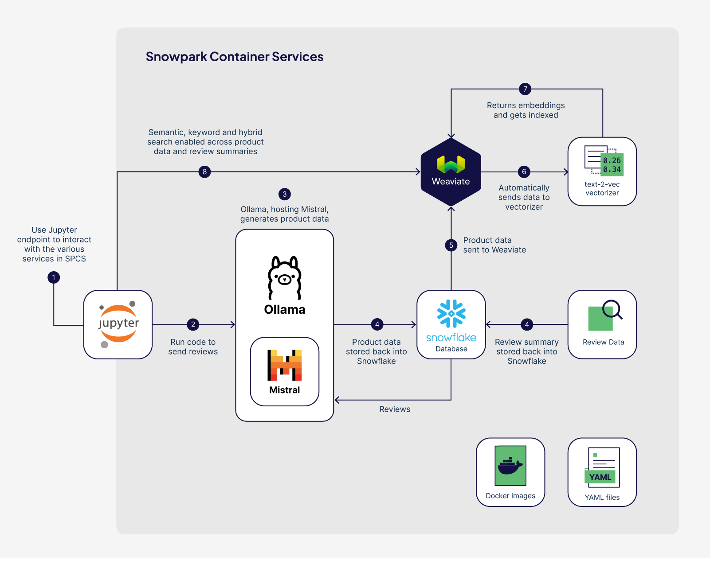
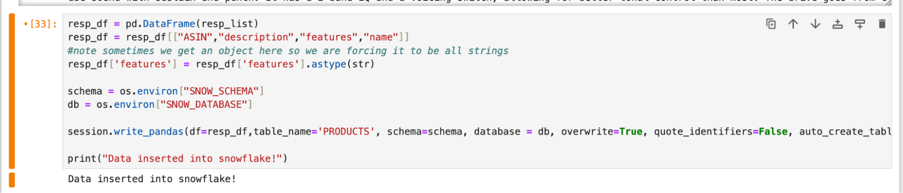

author: Jon Tuite
id: weaviate-generative-feedback-loop
summary: Create an end-to-end generative feedback loop by using an LLM to turn product review data into a searchable products collection in Weaviate.
categories: Getting-Started
environments: web
status: Published 
feedback link: https://github.com/Snowflake-Labs/sfguide-getting-started-weaviate-on-spcs/issues
tags: Weaviate, Containers, Ollama, Mistral, LLM, vectors, vectorizer, embeddings, semantic search, hybrid search 

# Weaviate Generative Feedback Loop


## Overview 
Duration: 2-3 hours

[Weaviate](https://weaviate.io/) is an open source, AI-native vector database that helps developers create intuitive and reliable AI-powered applications. In this quickstart, we will deploy Weaviate, Ollama, Mistral LLM, and a text-2-vec vecetorizer within of Snowpark Container Services (SPCS), along with a Jupyter server. Using these services, we will generate product data from reviews with an LLM, then use it to create a unique search experience for users to search for experiences with products.

### What You Will Learn 

- How to build and deploy Weaviate, Ollama, a text-2-vec vectorizer module and Jupyter in Snowpark container services
- How to create a generative feedback loop with a locally installed LLM
- How to automatically create embeddings (vectors) for your searchable data
- How to use volume mounts to persist changes in the file system
- How to load data from Snowflake into a Weaviate vector database
- How to run Keyword, Semantic, and Hybrid searches on your data in Weaviate

### What You Will Need

- [Docker Desktop](https://www.docker.com/products/docker-desktop/) installed
- [Python 3.10](https://www.python.org/downloads/) installed
    - Note that you will be creating a Python environment with 3.10 in the **Setup the Local Environment** step
- (Optional) [Git](https://git-scm.com/book/en/v2/Getting-Started-Installing-Git) installed
    - **Download the git repo [here](https://github.com/Snowflake-Labs/sfguide-weaviate-on-spcs.git)**. You can simply download the repo as a .zip if you don't have Git installed locally.
- (Optional) [VSCode](https://code.visualstudio.com/) (recommended) with the [Docker](https://marketplace.visualstudio.com/items?itemName=ms-azuretools.vscode-docker), [Python](https://marketplace.visualstudio.com/items?itemName=ms-python.python), and [Snowflake](https://marketplace.visualstudio.com/items?itemName=snowflake.snowflake-vsc) extensions installed.
- A non-trial Snowflake account in a supported [AWS region](https://docs.snowflake.com/en/developer-guide/snowpark-container-services/overview#available-regions).
- Snowpark Container Services (SPCS) enabled on your account

### What You Will Build 

- A complete end-to-end solution from loading data, generating new data with an LLM, and searching using Weaviate
- A hosted Weaviate service running inside of Snowpark Container Services
- A hosted LLM (Mistral 0.2), using Ollama
- A hosted Jupyter Notebook service running inside of Snowpark Container Services
- A Jupyter Notebook to load review data into Snowflake then generate new product data using an LLM
- A Jupyter Notebook to load and query/search a collection of products


## Prerequisites

- (optional) The [weaviate-on-spcs](https://quickstarts.snowflake.com/guide/weaviate-on-spcs/index.html) quickstart

- [SFGUIDE-WEAVIATE-ON-SPCS](https://github.com/Snowflake-Labs/sfguide-weaviate-on-spcs) repo
  - Within the repo is a **cookbooks** folder and all required files can be found in the "**cookbooks/Ollama**" folder

- [Ollama](https://github.com/jmorganca/ollama) repository so you can build a docker image

- [Product review dataset](https://www.kaggle.com/datasets/eswarchandt/amazon-music-reviews)

These steps are only shown as an example, and following along with the example may require additional rights to third-party data, products, or services that are not owned or provided by Snowflake.  Please ensure that you have the appropriate rights in third-party data, products, or services before continuing.

## Loading Data

Start by loading data into Snowflake.  Skip this step if your data is already there.

Dataset:
[https://www.kaggle.com/datasets/eswarchandt/amazon-music-reviews](https://www.kaggle.com/datasets/eswarchandt/amazon-music-reviews)

These steps are only shown as an example, and following along with the example may require additional rights to third-party data, products, or services that are not owned or provided by Snowflake.  Please ensure that you have the appropriate rights in third-party data, products, or services before continuing.

```SQL
------------LOGIN---------
snowsql -a "YOURINSTANCE" -u "YOURUSER"
```
```SQL
------------Create User/Role---------
USE ROLE ACCOUNTADMIN;
CREATE SECURITY INTEGRATION SNOWSERVICES_INGRESS_OAUTH
  TYPE=oauth
  OAUTH_CLIENT=snowservices_ingress
  ENABLED=true;

CREATE USER weaviate_user PASSWORD='weaviate123' DEFAULT_ROLE = WEAVIATE_ROLE DEFAULT_SECONDARY_ROLES = ('ALL') MUST_CHANGE_PASSWORD = FALSE;

GRANT ROLE WEAVIATE_ROLE TO USER weaviate_user;

ALTER USER weaviate_user SET DEFAULT_ROLE = WEAVIATE_ROLE;

```
```SQL
------CREATE PRODUCT REVIEWS DATABASE -----
USE ROLE SYSADMIN;

CREATE OR REPLACE WAREHOUSE WEAVIATE_WAREHOUSE WITH
  WAREHOUSE_SIZE='X-SMALL'
  AUTO_SUSPEND = 180
  AUTO_RESUME = true
  INITIALLY_SUSPENDED=false;

CREATE DATABASE IF NOT EXISTS WEAVIATE_PRODUCT_REVIEWS;

GRANT all on database WEAVIATE_PRODUCT_REVIEWS to role WEAVIATE_ROLE;

USE DATABASE WEAVIATE_PRODUCT_REVIEWS;

```

```SQL
--------CREATE FILE FORMAT  -----

create or replace file format my_csv_format 
  type = csv 
  field_delimiter = ',' 
  skip_header = 1 
  null_if = ('NULL', 'null') 
  FIELD_OPTIONALLY_ENCLOSED_BY='"'
  empty_field_as_null = true;

-----CREATE STAGE--------

CREATE OR REPLACE STAGE REVIEW_DATA ENCRYPTION = (TYPE = 'SNOWFLAKE_SSE');

grant all PRIVILEGES on stage REVIEW_DATA to WEAVIATE_ROLE;
grant all PRIVILEGES on schema PUBLIC to WEAVIATE_ROLE;
grant all on schema PUBLIC to role WEAVIATE_ROLE;

----------PUT FILE INTO STAGE ------------
PUT file:///YOUR/PATH/Musical_instruments_reviews.csv @REVIEW_DATA overwrite=true;
```
```SQL
------------COPY DATA INTO SNOWFLAKE TABLES------------
COPY INTO PRODUCT_REVIEWS FROM @REVIEW_DATA FILE_FORMAT = (format_name = 'my_csv_format' , error_on_column_count_mismatch=false)
 pattern = '.*Musical_instruments_reviews.csv.gz' on_error = 'skip_file';
```


<b>NOTE:</b> This data only includes reviews and has no product information except the ASIN, a unique identifier that Amazon uses for each product.


## Create Docker Images

First, create a stage for docker images and upload the required YAML files.

```SQL
--Create an image repo
CREATE OR REPLACE IMAGE REPOSITORY WEAVIATE_PRODUCT_REVIEWS.PUBLIC.WEAVIATE_REPO;

--upload yaml files
PUT file:///<PATH>spec-jupyter.yaml @yaml_stage overwrite=true auto_compress=false;
PUT file:///<PATH>spec-text2vec.yaml @yaml_stage overwrite=true auto_compress=false;
PUT file:///<PATH>spec-weaviate.yaml @yaml_stage overwrite=true auto_compress=false;
PUT file:///<PATH>spec-ollama.yaml @yaml_stage overwrite=true auto_compress=false;
```
### Get Ollama

For this quickstart, we are using Ollama to host the LLM model, download their repo so you can build the Docker image.  You can download the repo here:

[https://github.com/jmorganca/ollama](https://github.com/jmorganca/ollama)

### Create Ollama Docker Image

Once you download the repo, cpoy all the contents of the “**Cookbooks/Ollama/OllamaDocker**” folder into the Ollama Repo and overwrite the files as necessary.  

After the files were copied, navigate to the Ollama repo and used the following command to create the Ollama image.  

Login to Docker first:
```SHELL
docker login ACCOUNT-ORG.registry.snowflakecomputing.com -u USERNAME
```

Build the image
```SHELL
docker build --rm --platform linux/amd64 -t ollama .
```

Tag and upload the image
```SHELL
#Tag
docker tag ollama <SNOWACCOUNT-SNOWORG>.registry.snowflakecomputing.com/weaviate_product_reviews/public/weaviate_repo/ollama
#Push
docker push <SNOWACCOUNT-SNOWORG>.registry.snowflakecomputing.com/weaviate_product_reviews/public/weaviate_repo/ollama

```
### Upload YAML
Back in Snowflake, upload the YAML file for the image to use.

```SQL
PUT file:///YOUR/PATH/Docker/spec-ollama.yaml @yaml_stage overwrite=true auto_compress=false overwrite=true;
```
### Add images for Weaviate, text-2-vec, and jupyter

Following the same steps as above, create, tag, and upload images for the remaining services we will create.

```SHELL
#----weaviate------
docker build --rm --platform linux/amd64 -t weaviate -f weaviate.Dockerfile . 
docker tag weaviate <SNOWACCOUNT-SNOWORG>.registry.snowflakecomputing.com/weaviate_product_reviews/public/weaviate_repo/weaviate
docker push <SNOWACCOUNT-SNOWORG>.registry.snowflakecomputing.com/weaviate_product_reviews/public/weaviate_repo/weaviate

#----text2vec------
docker build --rm --platform linux/amd64 -t text2vec -f text2vec.Dockerfile . 
docker tag text2vec <SNOWACCOUNT-SNOWORG>.registry.snowflakecomputing.com/weaviate_product_reviews/public/weaviate_repo/text2vec
docker push <SNOWACCOUNT-SNOWORG>.registry.snowflakecomputing.com/weaviate_product_reviews/public/weaviate_repo/text2vec

#--------Jupyter-------
docker build --rm --platform linux/amd64 -t jupyter -f jupyter.Dockerfile . 
docker tag jupyter <SNOWACCOUNT-SNOWORG>.registry.snowflakecomputing.com/weaviate_product_reviews/public/weaviate_repo/jupyter
docker push <SNOWACCOUNT-SNOWORG>.registry.snowflakecomputing.com/weaviate_product_reviews/public/weaviate_repo/jupyter


```
## Start Services

Once the docker images and yaml files are all uploaded, .

### Create Compute Pool
```SQL
CREATE COMPUTE POOL OLLAMA_POOL
MIN_NODES = 1
MAX_NODES = 1
INSTANCE_FAMILY = GPU_NV_M;
```


### Wait for Pool to start
Make sure to wait for the compute pool to be in “Idle” state before creating the service.  You can see the state with the following command:
```
DESCRIBE COMPUTE POOL OLLAMA_POOL;
```

### Run on GPUs
In this example, we are using a Medium NVIDIA GPU class instance for the compute pool.  Ollama has the flexibility to be able to handle both CPU and GPU instances, but GPUs are best for an LLM. 

For a list of available instance types you can spin up in SPCS, check out [this page](https://docs.snowflake.com/en/sql-reference/sql/create-compute-pool).

**Note:** there are two settings in the YAML file are are needed to take advantage of the GPUs:


```
ENABLE_CUDA: 1
NVIDIA_VISIBLE_DEVICES : all
```

## Log into Jupyter
The Ollama image has Jupyter notebooks installed on it locally. This is so you can run through the code to create the data, then shut down the entire instance since we don’t need it to support the search.

You can check the status of the service by running:


```
show services;
```

### Get Jupyter Key From Logs
Once the service is running, grant permission to it and log into the Jupyter notebook interface. To do so, you first need to grab the Jupyter Notebooks key.  Do this by looking at the log for the service by running these commands:


```
GRANT USAGE ON SERVICE OLLAMA TO ROLE WEAVIATE_ROLE;

CALL SYSTEM$GET_SERVICE_LOGS('WEAVIATE_PRODUCT_REVIEWS.PUBLIC.OLLAMA', '0', 'ollama');
```

When running this command you should see a log displayed with some information about Jupyter Notebooks and a key.  **Copy that key**, you will need it in the next step.  

### Access Jupyter Notebooks

Get the Jupyter endpoint on the Ollama service by running this command:

```
SHOW ENDPOINTS IN SERVICE OLLAMA;
```
This shows the endpoints for Ollama and Jupyter.  Grab the URL for the Jupyter endpoint and paste it into a browser. 

Using the Snowflake Login we set up earlier,  log into the Jupyter endpoint, then, using the key from above, log in to the Jupyter Notebooks interface.  It should load a file browser like in the screenshot below:


## Start Ollama Service and Mistral Model

Once logged in to Jupyter, launch a Terminal window with the top menu: 


Run the following command to start the Ollama server:

```
/bin/ollama serve
```


You should see messages about how Ollama has detected the GPUs and has successfully started.

Then, launch a **second** Terminal window from Jupyter.

In this window run the command to launch the Mistral model:

```
ollama run mistral
```

This will take a few minutes to download the latest model and will eventually provide you with a prompt to test it out


## Generate Product Data with Mistral

Back in Jupyter Notebooks, load the provided notebook: **Ollama/Create_Product_Descriptions.ipynb.**

The first few steps loads the libraries needed and creates the connection into Snowflake.


### Create Prompts
Then load all the review data by using a distinct list of ASINs.  For each ASIN create a prompt using the first 20 reviews. 

**Note:**This part can be easily configured since we are using a pandas dataframe, and you may want to take the top 20 most _recent_ reviews instead of the first 20.

### Send to Mistral

Once I created the prompts, I needed to send them each to our local Mistal model and ask it to respond back with JSON that I could use to insert back into Snowflake.


### Send the Generated Data to Snowflake

Sometimes the LLM provides additional fields that we didn’t ask for, or objects instead of strings, but that’s okay – it can be removed before we send it to Snowflake.

You should see the message “Data inserted into Snowflake!” if everything went well. 




### Confirm Generated Data is in Snowflake

Back in Snowflake check the table to make sure all the data made it over.  Once you have confirmed you have the data, you can spin down the LLM


```
DROP SERVICE OLLAMA;
DROP COMPUTE POOL OLLAMA_POOL;
```


## Send Product Data to Weaviate

Now that we have our new PRODUCTS table we need to send it to Weaviate and vectorize the data.

### Spin up Weaviate, Jupyter, and Text2Vec

Next, spin up resources for Weaviate, Jupyter Notebooks, and the Text2Vec vectorizer module.  Follow the same process as before and create the compute pools, wait for them to go into the Idle state, then create the services.


```SQL
---Create the rest of the services------
CREATE COMPUTE POOL IF NOT EXISTS WEAVIATE_COMPUTE_POOL
  MIN_NODES = 1
  MAX_NODES = 1
  INSTANCE_FAMILY = CPU_X64_S
  AUTO_RESUME = true;

CREATE COMPUTE POOL IF NOT EXISTS TEXT2VEC_COMPUTE_POOL
  MIN_NODES = 1
  MAX_NODES = 1
  INSTANCE_FAMILY = GPU_NV_S
  AUTO_RESUME = true;

CREATE COMPUTE POOL IF NOT EXISTS JUPYTER_COMPUTE_POOL
  MIN_NODES = 1
  MAX_NODES = 1
  INSTANCE_FAMILY = CPU_X64_S
  AUTO_RESUME = true;


CREATE SERVICE WEAVIATE
  IN COMPUTE POOL WEAVIATE_COMPUTE_POOL 
  FROM @YAML_STAGE
  SPEC='spec-weaviate.yaml'
  MIN_INSTANCES=1
  MAX_INSTANCES=1;

CREATE SERVICE JUPYTER
  IN COMPUTE POOL JUPYTER_COMPUTE_POOL 
  FROM @YAML_STAGE
  SPEC='spec-jupyter.yaml'
  MIN_INSTANCES=1
  MAX_INSTANCES=1;

CREATE SERVICE TEXT2VEC
  IN COMPUTE POOL TEXT2VEC_COMPUTE_POOL 
  FROM @YAML_STAGE
  SPEC='spec-text2vec.yaml'
  MIN_INSTANCES=1
  MAX_INSTANCES=1;


```
### Grant Permissions to the Services
```SQL
GRANT USAGE ON SERVICE JUPYTER TO ROLE WEAVIATE_ROLE;
GRANT USAGE ON SERVICE WEAVIATE TO ROLE WEAVIATE_ROLE;
GRANT USAGE ON SERVICE TEXT2VEC TO ROLE WEAVIATE_ROLE;
```

### Log into Jupyter Notebooks Endpoint

Once all the services were up and running, log into the Jupyter notebooks UI on the Jupyter service.  

Follow the same process as last time and grab the key from the log, then use the key to login to Jupyter.

**Note: ** Make sure you have closed the previous Jupyter window or you will get a token error

### Copy Data to Weaviate

Open the file **Copy_Products_to_Weaviate.ipynb** notebook.


Run through the notebook and it will copy the newly generated data over to Weaviate.  Since Weaviate is set up to automatically use the Text2Vec vectorizer module, the data gets automatically vectorized as it lands in Weaviate.


## Search

Finally, try some queries on the data to test out Weaviate’s semantic and hybrid search capabilities. With this data, you can now search for experiences, feelings, keywords, or product names of the music-related products.


## Cleanup

If you want to suspend the services you can do so with these commands:

```SQL
ALTER COMPUTE POOL OLLAMA_POOL SUSPEND;
ALTER SERVICE OLLAMA SUSPEND;
ALTER COMPUTE POOL WEAVIATE_POOL SUSPEND;
ALTER SERVICE WEAVIATE SUSPEND;
...etc
```
Cleanup...

```SQL
USE ROLE ACCOUNTADMIN;

DROP SERVICE WEAVIATE;
DROP SERVICE JUPYTER;
DROP SERVICE TEXT2VEC;
DROP SERVICE OLLAMA;

DROP COMPUTE POOL WEAVIATE_COMPUTE_POOL;
DROP COMPUTE POOL JUPYTER_COMPUTE_POOL;
DROP COMPUTE POOL TEXT2VEC_COMPUTE_POOL;
DROP COMPUTE POOL OLLAMA_POOL;
```
Cleanup everything...
```SQL
DROP IMAGE REPOSITORY WEAVIATE_PRODUCT_REVIEWS.PUBLIC.WEAVIATE_REPO;

DROP DATABASE WEAVIATE_PRODUCT_REVIEWS.PUBLIC;

DROP WAREHOUSE WEAVIATE_WAREHOUSE;

DROP USER weaviate_user;

DROP ROLE WEAVIATE_ROLE;

DROP SECURITY INTEGRATION SNOWSERVICES_INGRESS_OAUTH;
```


